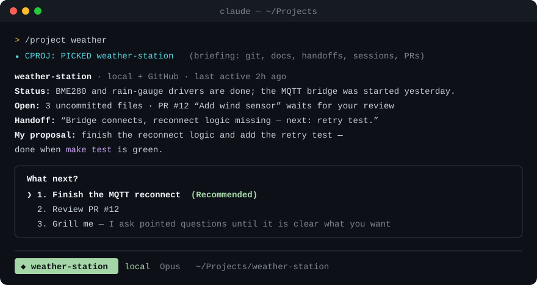
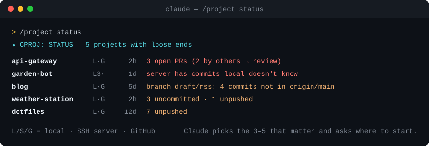
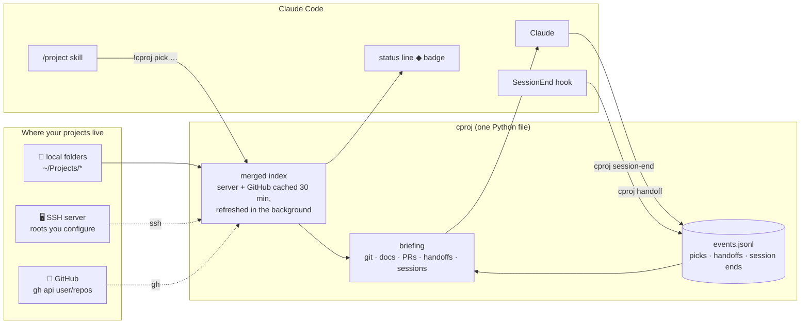
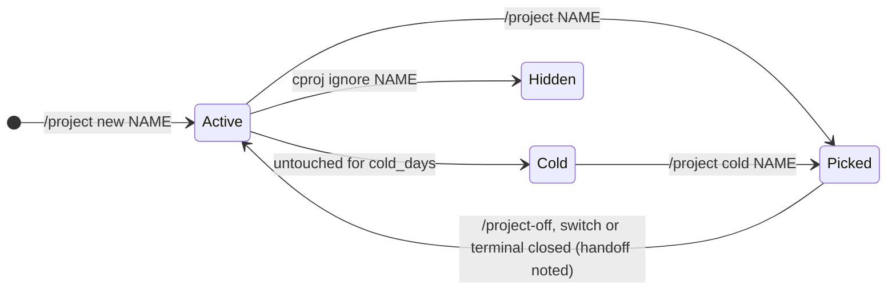

# cproj — `/project` for Claude Code

**Jump into any of your projects from inside Claude Code.** Local folders, repos on an SSH server and GitHub all show up in
one searchable list. Pick one, and Claude gets a compact briefing, tells you in ten lines where things stand, proposes
the next step (or grills you until the goal is clear) and gets to work. A badge in the status line shows which project
the session belongs to.

<p align="center">
  
</p>

<p align="center">
  <a href="LICENSE"></a>
  
  
</p>

---

## Why

Every new Claude Code session starts cold: which folder, what was I doing, is there a PR waiting, did I push that? You
end up re-explaining the project or letting Claude grep around for a while. `cproj` does that homework **before** Claude
reads your first message — in one shell call, typically under a second — and keeps notes so the next session starts warm.

## What you get

| | |
|---|---|
| **One index, three places** | Folders under `~/Projects` (or wherever you keep them), project folders on an SSH server, and your GitHub repos — merged by remote URL and name, cached so the list appears instantly. |
| **A briefing, not a tour** | Git state and recent commits, `CLAUDE.md` (with `@imports` resolved), status docs such as `HANDOFF.md` / `PROGRESS.md`, open issues and PRs, what differs on the server. |
| **Pick in the session** | `/project` asks inside Claude Code; `/project weath` jumps straight in; ambiguous input gets a short multiple choice. |
| **Grill me** | When the next step is not obvious, Claude asks one pointed question per round until the task fits in one sentence plus a done criterion. |
| **Status line badge** | `◆ weather-station  local` while a project is active; `◇ name` when you are merely inside a project folder. |
| **Handoffs** | Switching projects or leaving with `/project-off` writes a short handoff note; closing the terminal records a mechanical one (new commits, uncommitted files). The next briefing starts with it. |
| **Resume sessions** | The briefing lists the last Claude sessions that touched the project, with a ready `claude -r <id>`. |
| **`/project status`** | Every project with loose ends — uncommitted work, unpushed commits, branches that never reached main, PRs waiting for your review, server vs local drift. |
| **Create projects** | `/project new garden-bot` checks for similar names everywhere, then scaffolds the folder, git, `CLAUDE.md`, `docs/PROGRESS.md`, optionally a GitHub repo. |
| **Cold storage** | Projects untouched for 120 days drop out of lists and search; `/project cold` shows them and picking one wakes it up. |
| **Desktop launcher** | `cproj launch` (bind it to a key in your window manager): pick a project → new terminal with Claude in it, new session or resume. |

<p align="center">
  
</p>

## How it works



The `/project` skill uses Claude Code's `` !`command` `` injection: `cproj pick <your input>` runs **before** Claude
sees the prompt, so the briefing is already in context — no tool round-trips, no exploration. Its first line is a
marker (`CPROJ: PICKED …`, `CHOOSE`, `AMBIGUOUS`, `NO MATCH`, `STATUS`, `COLD`, …) and the skill tells Claude exactly
how to react to each one.

### A project's life



## Install

Requirements: Claude Code, Python 3.8+, git. Optional: [`gh`](https://cli.github.com) (logged in) for GitHub, an SSH
host alias for the server, a dmenu-style picker such as `fuzzel`, `wofi --dmenu` or `rofi -dmenu` for the launcher.

```bash
git clone https://github.com/legifx/cproj.git ~/Projects/cproj
cd ~/Projects/cproj && ./install.sh
```

The installer is idempotent and backs up every file it touches. It

- links `cproj` into `~/.local/bin` and the skills `project` + `project-off` into `~/.claude/skills`,
- adds the status line (only if you do not have one yet) and a `SessionEnd` hook to `~/.claude/settings.json`,
- binds `ctrl+x p` → `/project` and `ctrl+x o` → `/project-off` in `~/.claude/keybindings.json` (unless taken).

Restart Claude Code and type `/project`. Update with `git pull`; remove with `./install.sh --uninstall`.

## Usage

| In Claude Code | What happens |
|---|---|
| `/project` or `ctrl+x p` | Choose from recently used and active projects, or type a search term |
| `/project weather` | Search and jump in (exact, prefix, substring, description, fuzzy) |
| `/project new garden-bot` | Duplicate check everywhere → a few questions → project created and picked |
| `/project status` | Every loose end across all projects (`/project status fetch` fetches remotes first) |
| `/project cold` · `/project cold fossil` | Show cold storage · wake a project |
| `/project +` | GUI picker instead of the in-session question |
| `/project-off` or `ctrl+x o` | Handoff if something happened, badge off, back to project-free work |

| In a shell | |
|---|---|
| `cproj list [--cold\|--all\|--json]` | The index; `L S G` = local / server / GitHub |
| `cproj status [--fetch]` | Same overview as `/project status` |
| `cproj sessions NAME` | Claude sessions that worked on a project |
| `cproj ignore 'server:*backup*'` | Hide projects by name or path glob, optionally for one source |
| `cproj launch` | Desktop launcher — bind it to a key, e.g. niri: `Mod+P { spawn "cproj" "launch"; }` |
| `cproj refresh` | Reload the server/GitHub cache now |

## Configuration

Everything is optional. Without a config, `cproj` indexes `~/Projects` and your GitHub repos.
Copy [`config.example.json`](config.example.json) to `~/.config/cproj/config.json` and keep what you need:

| Key | Default | Meaning |
|---|---|---|
| `projects_dirs` | `["~/Projects"]` | Folders whose subfolders are projects; the first one receives new projects |
| `skip_dirs` | `[]` | Subfolder names to leave out |
| `server` | off | `{"host": "<ssh alias>", "roots": ["~"], "new_root": "~", "exclude": [...]}` |
| `github` | `true` | Include your repos (owner, collaborator, organisation member) via `gh` |
| `cold_days` | `120` | After how many quiet days a project moves to cold storage |
| `git_identity` | git's own | `{"name", "email"}` for the first commit of new projects |
| `template_dir` | built-in | Your own skeleton for new projects; `{name}`, `{desc}`, `{date}` are filled in |
| `on_create` | none | Command run after creating, e.g. to register the project elsewhere (`{name}`, `{path}`, `{desc}`) |
| `index_md` | none | A markdown table `\| **name** \| description \| status \| … \| entry file \|` with extra metadata |
| `registry_json` | none | A JSON list of `{name, path, status, note, progress, open_items}` from another project tracker |
| `picker` | fuzzel | dmenu-style command that prints the chosen **index** |
| `terminal` | first found | Terminal command for the launcher; `{dir}` and `{title}` are filled in |

## Privacy

`cproj` runs locally and sends nothing anywhere. It reads your project folders, runs `git`, `ssh <your host>` and
`gh` with your own credentials, and reads Claude Code's local transcripts (`~/.claude/projects`) only to find titles and
working directories of past sessions. Its own data stays on your machine:

| Path | Content |
|---|---|
| `~/.config/cproj/` | `config.json`, `ignore` |
| `~/.cache/cproj/` | index caches, per-session badges, recent picks — safe to delete |
| `~/.local/state/cproj/events.jsonl` | picks, handoff notes, session ends |

What ends up in Claude's context is what you would otherwise paste yourself: git logs, project docs, PR titles.

## Development

```bash
python3 -m unittest discover -s tests -v   # end-to-end tests in a throwaway HOME, no network
```

`cproj.py` is a single standard-library file; the skills are plain Markdown in `skills/`. Issues and pull requests welcome.

## License

[MIT](LICENSE)
